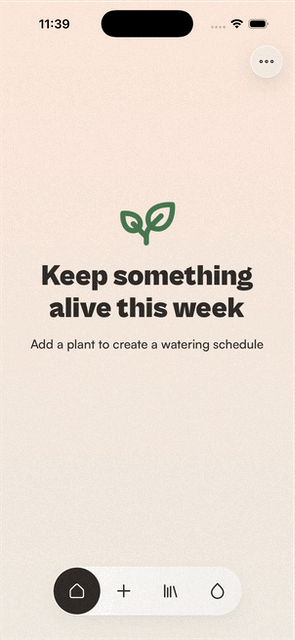
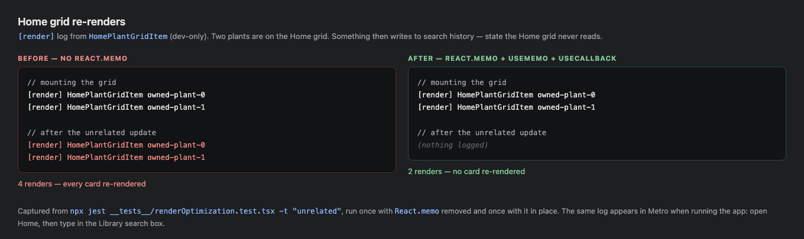
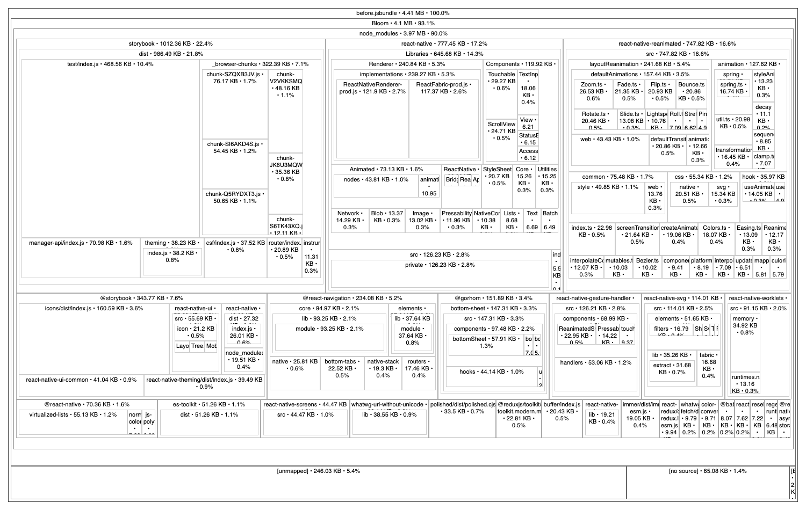
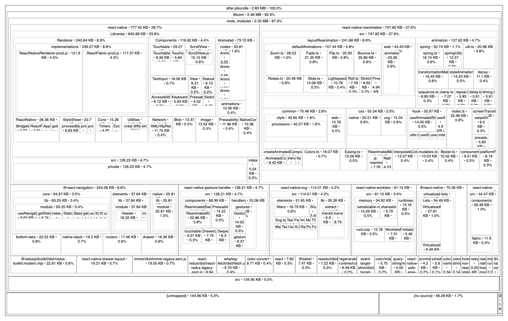

# Bloom — performance optimisation

Bloom is a React Native plant-care app: identify a plant from a photo, track watering, and save
favourites.

Performance optimisation scope: 
* added animation
* stopped excessive re-rendering
* reduced production bundle size

---

## 1. Analysis

**Animation.** The tab bar and the Favorites filter chips both switched state instantly,
with no transition.

**Fewer re-renders.** `PlantDataProvider` holds all its state in one context value, so any
change to it re-renders every consumer. On top of that `HomeScreen` rebuilt its `plants` array on
every render, gave each card a new `onPress` function, and `PlantCard` was not memoized. Typing in
the Library search box re-rendered every card on Home.

**Bundle size.** Storybook: 1,012 KB in the production bundle. Larger than `react-native`
(777 KB) and about three times the size of all app code (450 KB).

---

## 2. Animation (Reanimated)

Two components animate: the bottom tab bar (`src/components/ui/NavBar`) and the Favorites filter
chips (`src/components/ui/Tabs`).

Both use one pill that slides to the selected item. Tap a tab or a chip: the dark pill moves to
it, and the icon or label under it switches from dark to white.

The shared hook is `src/components/ui/SlidingIndicator/useSlidingIndicator.ts`. It measures each
item with `onLayout`, holds the pill's position in `useSharedValue`, and springs it to the active
item:

```tsx
x.value = withSpring(target.x, springs.slidingIndicator);
width.value = withSpring(target.width, springs.slidingIndicator);
```

`useAnimatedStyle` turns those into the pill's transform and width. Nav items are a fixed 64px so
only `x` moves; chips are as wide as their text so `width` animates too. The spring config is one
shared token in `src/theme/motion.ts`. `useReducedMotion()` skips the animation when the OS
accessibility setting is on.

The tab bar had to be refactored for the animation to work. 

Each of the four tab screens rendered its own copy of the bar, and `detachInactiveScreens={false}`
keeps every screen mounted. That meant four bars alive at once, each with a permanently fixed
active item. There was never one pill that could move, only four that were swapped in and out.

What changed:

- `TabNavigator` now renders one `FloatingTabBar` through its `tabBar` prop, positioned absolutely
  so the frosted bar still sits over scrolling content.
- The four tab screens no longer render a bar. They ask `ScreenLayout` to reserve the same bottom
  space with a new `reserveBottomBarSpace` prop. Reserving space and rendering the bar used to
  be the same prop; they are now separate.
- `MainTabBar` reads the active tab from navigation state instead of being told by each screen.

This also removed four duplicated blocks and stopped three redundant bars recomputing the
watering due-count on every state change.



---

## 3. Fewer re-renders

- `PlantCard` wrapped in `React.memo`.
- `HomeScreen`'s `plants` array built with `useMemo`.
- The per-card `onPress` closure replaced with a stable `useCallback`, bound to its plant id inside
  a memoized `HomePlantGridItem`.

`React.memo` only helps if the props are the same objects as last time, so the stable `useCallback`
is what makes the other two work.

`HomePlantGridItem` logs each render behind `__DEV__`:

```
[render] HomePlantGridItem owned-plant-0
```

With two plants on Home, something then writes to search history — state the Home grid never
reads. Before: 4 renders, both cards re-rendered. After: 2 renders, neither card re-rendered.
The screenshot below shows both runs. The same log appears in Metro when running the app: open
Home, then type in the Library search box.

The same behaviour is covered by a test so it stays fixed, `__tests__/renderOptimization.test.tsx`:

```
✓ an unrelated PlantDataProvider update does not re-render the Home plant cards
✓ a real owned-plant change still re-renders its card
```

The second test checks the grid still updates when a plant actually changes, so the
memoization can't make it stale.



---

## 4. Bundle size

### Before

4,625,619 bytes. Largest items:

| Package | Size |
| --- | --- |
| `storybook` | 1,012 KB |
| `react-native` | 777 KB |
| `react-native-reanimated` | 748 KB |
| app code | 450 KB |
| `@storybook/icons` | 161 KB |
| `@gorhom/bottom-sheet` | 147 KB |

### What was removed

Storybook. It was added for the earlier UI-library assignment and is not part of the app, but it
was still compiled into every production build: `App.tsx` guarded it with
`process.env.STORYBOOK_ENABLED`, which is a runtime check, while Metro builds its dependency graph
statically and pulled the whole tree in regardless.

Removed: both packages, `.rnstorybook/`, 22 `*.stories.tsx` files, two helper scripts, and the
`App.tsx` / `metro.config.js` wiring. It stays recoverable from git history.

The brief suggests swapping a heavy package for a lighter one. There is no `moment` or `lodash`
here, and no other dependency has a lighter equivalent:

| Package | Alternative? |
| --- | --- |
| `@react-navigation/*`, `@reduxjs/toolkit`, `react-redux` | Required by earlier assignments |
| `react-native-reanimated`, `react-native-worklets`, `react-native-gesture-handler` | This assignment's animation |
| `react-native-svg` | Every icon |
| `@react-native-community/blur`, `react-native-linear-gradient` | The design |
| `react-native-image-picker`, `@react-native-async-storage/async-storage` | Camera, storage |

### After

| | Bytes |
| --- | --- |
| Before | 4,625,619 |
| After | 2,778,691 |
| **Saved** | **1,846,928 — 39.9%** |

`storybook`, `@storybook/icons`, `@gorhom/bottom-sheet`, `es-toolkit`, `polished` and
`whatwg-url-without-unicode` removed. 

### Reproducing it

```bash
npx react-native bundle --platform ios --dev false --entry-file index.js \
  --bundle-output /tmp/bloom.jsbundle --sourcemap-output /tmp/bloom.jsbundle.map \
  --sourcemap-sources-root "$PWD"

npx source-map-explorer /tmp/bloom.jsbundle /tmp/bloom.jsbundle.map --no-border-checks --html
```

`--no-border-checks` is required. Without it `source-map-explorer` fails on React Native bundles
with *"source map refers to generated column Infinity"*. `--sourcemap-sources-root` keeps the
treemap rooted at the project instead of nesting it under the absolute path to it.

The 40% is off the JavaScript bundle. The installed app also contains native libraries and assets,
so its total size drops by less.





